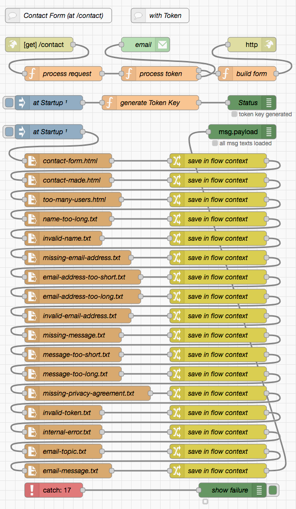

# node-red-contact-form-examples #

contact and user feedback flows for Node-RED

Often web sites offer visitors the possibility to contact the web page operator. This is usually achieved by means of a specific web page containing a feedback form and a button to submit the form contents.

This repository contains two examples for such an approach:

* the first one (called "User Feedback") assumes that users visiting the feedback page can be trusted, e.g., because they had to authenticate themselves before. As a consequence, there is no kind of captcha or similar mechanism to detect bots which try to submit SPAM through this form.
* the second one (called "Contact Form") does not make such an assumption - but it also avoids captchas, which often turn out not to be GDPR compliant. Instead, the first visit of the contact page creates a time-based token which gives the visitor a time slot ranging from 1 to 15 minutes after the first visit to submit a message - and this exactly once. Practice shows that having to wait for 1 minute before a message can be sent overtaxes bots and daunts human spammers. 

> Nota bene: this work is currently in progress, do not expect it to be finished before end of October 2021

> Just a small note: if you like this work and plan to use it, consider "starring" this repository (you will find the "Star" button on the top right of this page), so that I know which of my repositories to take most care of.

## Prerequisites ##

Both examples require the following Node-RED extension

* [node-red-node-email](https://github.com/node-red/node-red-nodes/tree/master/social/email) contains Node-RED nodes to send and receive simple emails

## User Feedback (without Token) ##

This example assumes that users visiting the page with a feedback form can be trusted, e.g., because they had to authenticate themselves before. If need be, the HTTP endpoint for this flow can be followed by an authentication node from the author's [node-red-authorization-examples](https://github.com/rozek/node-red-authorization-examples) - all three variants shown there are compatible with this flow.

#### Typical Workflow ####

The typical work flow looks as follows:

* a visitor navigates to the page containing the feedback form (in this example, that page is located at `/feedback`). Node-RED builds and sends that page with an empty form
* the visitor now completes this form (including the actual message) and presses a "Submit" button. Due to the way this form has been designed, modern browsers can already validate user input themselves and present proper error messages without loading the server.
* after submission, the server (i.e., Node-RED) validates any form input and either adds an error message to the form and sends it back or submits the message (by email) and responds with a web page that indicates success.

#### Request and Query Parameters ####

For the sake of simplicity, Node-RED always expects an HTTP GET request (even for form submission) with any form input passed as query parameters. The following parameters (and input element names) are expected:

* **`name`** may contain the name of the contacting user. It is optional, may be up to 80 characters long but must not contain any control characters
* **`email`** must contain the email address of the contacting user. It is mandatory, may be up to 255 characters long and must contain a syntactically valid email address.
* **`message`** must contain the actual message to be sent. It is mandatory and may contain between 3 and 32768 characters
* **`privacy`** must contain the text "`agreed`". In the form, this parameter is represented by a checkbox that - when checked - indicates that the user has (read and) agreed to a "data privacy statement" which has to be provided on a separate web page

#### Additional Assets ####

Besides the actual flow, this example also comes with a set of files containing the web pages and messages this flow uses:

* **`feedback/feedback-form.html`** contains the web page with the HTML form a user has to complete in order to send some feedback. It should contain the placeholders `${ServerMessage}`, `${UserName}`, `${EMailAddress}` and `${UserMessage}` - all these placeholders will be replaced with their values before the web page is presented to the user
* **`feedback/feedback-sent.html`** contains the web page which informs a user about successfull feedback submission
* **`feedback/name-too-long.txt`** defines the text to be written into placeholder `${ServerMessage}` if the entered user name is longer than 80 characters
* **`feedback/invalid-name.txt`** defines the text to be written into placeholder `${ServerMessage}` if the entered user name contains invalid (i.e., control) characters
* **`feedback/missing-email-address.txt`** defines the text to be written into placeholder `${ServerMessage}` if no email address is was entered
* **`feedback/email-address-too-short.txt`** defines the text to be written into placeholder `${ServerMessage}` if the entered email address is shorter than 6 characters
* **`feedback/email-address-too-long.txt`** defines the text to be written into placeholder `${ServerMessage}` if the entered email address is longer than 255 characters
* **`feedback/invalid-email-address.txt`** defines the text to be written into placeholder `${ServerMessage}` if the entered email address looks (syntactically) invalid
* **`feedback/missing-message.txt`** defines the text to be written into placeholder `${ServerMessage}` if no feedback message was entered
* **`feedback/message-too-short.txt`** defines the text to be written into placeholder `${ServerMessage}` if the entered feedback message is shorter than 3 characters
* **`feedback/message-too-long.txt`** defines the text to be written into placeholder `${ServerMessage}` if the entered feedback message is longer than 32768 characters
* **`feedback/missing-privacy-agreement.txt`** defines the text to be written into placeholder `${ServerMessage}` if a user forgot to agree to the data privacy statement 
* **`feedback/internal-error.txt`** defines the text to be written into placeholder `${ServerMessage}` in case of an internal error
* **`feedback/email-topic.txt`** defines the (constant) "subject" of the feedback email. Chosen wisely, it may be used to filter feedback messages within an email client
* **`feedback/email-message.txt`** contains a template for the actual feedback email. It should contain the placeholders `${UserName}`, `${EMailAddress}` and `${UserMessage}` - all these placeholders will be replaced by their related form inputs before the email is sent.

Most probably, these files will have to be customized for your specific use case.

#### Text Placeholders for these Assets ####

Some of the assets shown above are actually templates which will have to be customized by Node-RED before being sent. These templates contain the following placeholders:

* **`ServerMessage`** will either contain an empty string (`''`) or an error message inserted by Node-RED because of an input validation error
* **`UserName`** will contain a string with the name of the contacting user as entered into the feedback form
* **`EMailAddress`** will contain a string with the email address of the contacting user as entered into the feedback form
* **`UserMessage`** will contain a string with the message of the contacting user as entered into the feedback form

### Installation ###

This feedback mechanism may be used as follows:

* import [this flow](feedback.json) into your Node-RED instance
* configure the "email" node, i.e. enter service details and credentials of an email account you may use for sending email messages
* copy all assets files into a subfolder `feedback` within your Node-RED working directory
* customize these assets (particularly `feedback/feedback-form.html` and `feedback/feedback-sent.html`) as needed
* provide a file `DataPrivacyStatement.html` in your Node-RED working directory which contains a web page with your data privacy statement

### Postman Collection ###

As usual, this repository contains a [collection of requests](PostmanCollection.json) which is to be imported into a [Postman](https://www.postman.com/) instance and simplfies testing the feedback mechanism.

## Contact Form (with Token) ##

This example does not make any assumptions about the visiting user. In order to prevent bots and humans from spamming, it uses time-based tokens (since captchas often lack GDPR-compliance). These tokens are created once the web page containg the contact firm is visited for the first time and allows the user to submit a message within a time window starting one minute after the first visit and ending 15 minutes later (practice has shown that having to wait for 1 minute before a message can be sent overtaxes bots and daunts human spammers). Each token may only be used _once_ preventing patient spammers from sending multiple emails within that time slot.

While any token is transmitted in plain text (and, thus, may be inspected by the client), its value is secured with a "message digest" - as a consequence, any attempt to change the token will inevitably be recognized and lead to permission loss. The key used to generate message digests is randomly chosen at server startup - a server restart will therefore automatically invalidate any active tokens.

Right now, up to 1000 users may try to submit a contact request simultaneously - all others will be rejected.

#### Typical Workflow ####

The typical work flow looks as follows:

* a visitor navigates to the page containing the contact form (in this example, that page is located at `/contact`). Node-RED builds and sends that page with an empty form
* the visitor now completes this form (including the actual message) and presses a "Submit" button. Due to the way this form has been designed, modern browsers can already validate user input themselves and present proper error messages without loading the server.
* after submission, the server (i.e., Node-RED) validates any form input and either adds an error message to the form and sends it back or submits the message (by email) and responds with a web page that indicates success.

#### Request and Query Parameters ####

For the sake of simplicity, Node-RED always expects an HTTP GET request (even for form submission) with any form input passed as query parameters. The following parameters (and input element names) are expected:

* **`token`** must contain a valid contact token. It will be created by the server and "hidden" from the contacting user
* **`name`** may contain the name of the contacting user. It is optional, may be up to 80 characters long but must not contain any control characters
* **`email`** must contain the email address of the contacting user. It is mandatory, may be up to 255 characters long and must contain a syntactically valid email address.
* **`message`** must contain the actual message to be sent. It is mandatory and may contain between 3 and 32768 characters
* **`privacy`** must contain the text "`agreed`". In the form, this parameter is represented by a checkbox that - when checked - indicates that the user has (read and) agreed to a "data privacy statement" which has to be provided on a separate web page

#### Additional Assets ####

Besides the actual flow, this example also comes with a set of files containing the web pages and messages this flow uses:

* **`contact/contact-form.html`** contains the web page with the HTML form a user has to complete in order to contact the web page operator. It should contain the placeholders `${ServerMessage}`, `${UserName}`, `${EMailAddress}`, `${UserMessage}` and `${Token}` - all these placeholders will be replaced with their values before the web page is presented to the user
* **`contact/contact-made.html`** contains the web page which informs a user about a successful approach
* **`contact/contact-overload.html`** contains the web page which is sent when too many users are trying to approach the web page operator simultaneously
* **`contact/name-too-long.txt`** defines the text to be written into placeholder `${ServerMessage}` if the entered user name is longer than 80 characters
* **`contact/invalid-name.txt`** defines the text to be written into placeholder `${ServerMessage}` if the entered user name contains invalid (i.e., control) characters
* **`contact/missing-email-address.txt`** defines the text to be written into placeholder `${ServerMessage}` if no email address is was entered
* **`contact/email-address-too-short.txt`** defines the text to be written into placeholder `${ServerMessage}` if the entered email address is shorter than 6 characters
* **`contact/email-address-too-long.txt`** defines the text to be written into placeholder `${ServerMessage}` if the entered email address is longer than 255 characters
* **`contact/invalid-email-address.txt`** defines the text to be written into placeholder `${ServerMessage}` if the entered email address looks (syntactically) invalid
* **`contact/missing-message.txt`** defines the text to be written into placeholder `${ServerMessage}` if no contact message was entered
* **`contact/message-too-short.txt`** defines the text to be written into placeholder `${ServerMessage}` if the entered contact message is shorter than 3 characters
* **`contact/message-too-long.txt`** defines the text to be written into placeholder `${ServerMessage}` if the entered contact message is longer than 32768 characters
* **`contact/missing-privacy-agreement.txt`** defines the text to be written into placeholder `${ServerMessage}` if a user forgot to agree to the data privacy statement
* **`contact/invalid-token.txt`** defines the text to be written into placeholder `${ServerMessage}` if the token is either invalid, has already been used or does not permit a message submission at the given time
* **`contact/internal-error.txt`** defines the text to be written into placeholder `${ServerMessage}` in case of an internal error
* **`contact/email-topic.txt`** defines the (constant) "subject" of the contact email. Chosen wisely, it may be used to filter contact messages within an email client
* **`contact/email-message.txt`** contains a template for the actual contact email. It should contain the placeholders `${UserName}`, `${EMailAddress}` and `${UserMessage}` - all these placeholders will be replaced by their related form inputs before the email is sent.

Most probably, these files will have to be customized for your specific use case.

#### Text Placeholders for these Assets ####

Some of the assets shown above are actually templates which will have to be customized by Node-RED before being sent. These templates contain the following placeholders:

* **`ServerMessage`** will either contain an empty string (`''`) or an error message inserted by Node-RED because of an input validation error
* **`UserName`** will contain a string with the name of the contacting user as entered into the contact form
* **`EMailAddress`** will contain a string with the email address of the contacting user as entered into the contact form
* **`UserMessage`** will contain a string with the message of the contacting user as entered into the contact form
* **`Token`** will contain a string with the token which controls during which time period a contact may be established

### Installation ###

This feedback mechanism may be used as follows:

* import [this flow](contact.json) into your Node-RED instance
* configure the "email" node, i.e. enter service details and credentials of an email account you may use for sending email messages
* copy all assets files into a subfolder `contact` within your Node-RED working directory
* customize these assets (particularly `contact/contact-form.html` and `contact/contact-made.html`) as needed
* provide a file `DataPrivacyStatement.html` in your Node-RED working directory which contains a web page with your data privacy statement

### Postman Collection ###

As usual, this repository contains a [collection of requests](PostmanCollection.json) which is to be imported into a [Postman](https://www.postman.com/) instance and simplfies testing the feedback mechanism.

## License ##

[MIT License](LICENSE.md)
