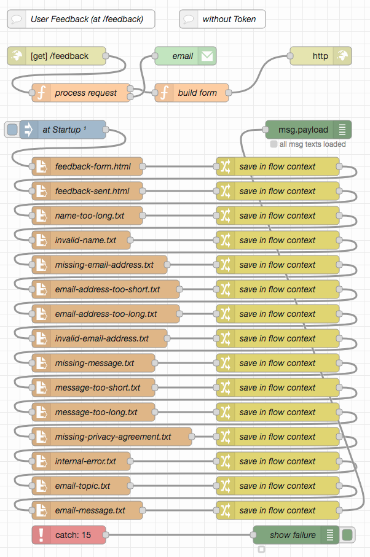

# node-red-contact-form-examples #

contact and user feedback flows for Node-RED

Often web sites offer visitors the possibility to contact the web page operator. This is usually achieved by means of a specific web page containing a feedback form and a button to submit the form contents.

This repository contains two examples for such an approach:

* the first one (called "User Feedback") assumes that users visiting the feedback page can be trusted, e.g., because they had to authenticate themselves before. As a consequence, there is no kind of captcha or similar mechanism to detect bots which try to submit SPAM through this form.
* the second one (called "Contact Form") does not make such an assumption - but it also avoids captchas, which often turn out not to be GDPR compliant. Instead, the first visit of the contact page creates a time-based token which gives the visitor a time slot ranging from 1 to 15 minutes after the first visit to submit a message - and this exactly once. Practice shows that having to wait for 1 minute before a message can be sent overtaxes bots and daunts human spammers. 

> Nota bene: this work is currently in progress, do not expect it to be finished before end of October 2021

> Just a small note: if you like this work and plan to use it, consider "starring" this repository (you will find the "Star" button on the top right of this page), so that I know which of my repositories to take most care of.

## Prerequisites ##

Both examples require the following Node-RED extension

* [node-red-node-email](https://github.com/node-red/node-red-nodes/tree/master/social/email) contains Node-RED nodes to send and receive simple emails

## User Feedback (without Token) ##

This example assumes that users visiting the page with a feedback form can be trusted, e.g., because they had to authenticate themselves before. If need be, the HTTP endpoint for this flow can be followed by an authentication node from the author's [node-red-authorization-examples](https://github.com/rozek/node-red-authorization-examples) - all three variants shown there are compatible with this flow.

#### Typical Workflow ####

The typical work flow looks as follows:

* a visitor navigates to the page containing the feedback form (in this example, that page is located at `/feedback`. Node-RED builds and sends that page with an empty form
* the visitor now completes this form (including the actual message) and presses a "Submit" button. Due to the way this form has been designed, modern browsers can already validate the input themselves and present proper error messages without loading the server.
* after submission, the server (i.e., Node-RED) validates any form input and either adds an error message to the form and sends it back or submits the message (by email) and responds with a web page that indicates success.

#### Request and Query Parameters ####

For the sake of simplicity, Node-RED always expects an HTTP GET request (even for form submission) with any form input passed as query parameters. The following parameters (and input element names) are expected:

* **`name`** may contain the name of the contacting user. It is optional, may be up to 80 characters long but must not contain any control characters
* **`email`** must contain the email address of the contacting user. It is mandatory, may be up to 255 characters long and must contain a valid email address.
* **`message`** must contain the actual message to be sent. It is mandatory and may contain between 3 and 32768 characters
* **`privacy`** must contain the text "`agreed`". In the form, this parameter is represented by a checkbox which - when checked - indicates that the user has (read and) agreed to a "data privacy statement" which has to be provided on a separate web page

#### Additional Assets ####

Besides the actual flow, this example also comes with a set of files containing the web pages and messages this flow uses:

* **`contact/feedback-form.html`** contains the web page 
* **`contact/feedback-sent.html`** 
* **`contact/name-too-long.txt`** 
* **`contact/invalid-name.txt`** 
* **`contact/missing-email-address.txt`** 
* **`contact/email-address-too-short.txt`** 
* **`contact/email-address-too-long.txt`** 
* **`contact/invalid-email-address.txt`** 
* **`contact/missing-message.txt`** 
* **`contact/message-too-short.txt`** 
* **`contact/message-too-long.txt`** 
* **`contact/missing-privacy-agreement.txt`** 
* **`contact/internal-error.txt`** 
* **`contact/email-topic.txt`** 
* **`contact/email-message.txt`** contains a template for the actual feedback email. It should contain the placeholders `${UserName}`, `${EMailAddress}` and `${UserMessage}` - all these placeholders will be replaced by their related form inputs before the email is sent.

Most probably, these files will have to be customized for your specific use case.

#### Text Placeholders for these Assets ####

Some of the assets shown above are actually templates which will have to be customized by Node-RED before being sent. These templates contain the following placeholders:

* **`ServerMessage`** will either contain an empty string (`''`) or an error message inserted by Node-RED because of an input validation error
* **`UserName`** will contain a string with the name of the contacting user as entered into the feedback form
* **`EMailAddress`** will contain a string with the email address of the contacting user as entered into the feedback form
* **`UserMessage`** will contain a string with the message of the contacting user as entered into the feedback form

### Installation ###

### Postman Collection ###

## Contact Form (with Token) ##

## License ##

[MIT License](LICENSE.md)
